\# 🛍️ Neural Retail Networks

\## Retail Sales Analytics \& Business Intelligence System

> \*Transforming 500K+ Retail Transactions into Actionable Business Insights\*

\---


\## 📌 Project Overview

\*\*Neural Retail Networks\*\* is an end-to-end \*\*Retail Sales Analytics and Business Intelligence System\*\* built using \*\*Power BI, DAX, Python, and Excel\*\*. The project analyses over \*\*500,000+ real-world retail transaction records\*\* to uncover sales trends, customer behaviour, product performance, regional insights, and inventory risks — delivering a complete, interactive BI solution across \*\*12 Power BI dashboards\*\*.

This project was developed as part of a \*\*Data Science \& Analytics Industry Project\*\*, simulating a real-world retail business intelligence system used by analysts to support data-driven decision-making.

\---


\## 🎯 Objectives

\- Analyse retail sales and customer data across 500K+ transactions to uncover business trends

\- Develop 12 interactive Power BI dashboards for real-time business performance monitoring

\- Track 10+ KPIs including revenue, orders, customers, quantity sold, and average order value

\- Identify top and bottom performing products across 3,631 unique SKUs by revenue and quantity

\- Analyse customer purchasing patterns using RFM segmentation across 4,304 customers

\- Support data-driven business decisions through geographic, seasonal, and inventory risk analysis

\---


\## 🗂️ Dataset Information


| Attribute | Details |

|-----------|---------|

| \*\*Dataset Type\*\* | UK-based Retail Sales Transactions |

| \*\*Total Records\*\* | \~500,000+ transaction records |

| \*\*Date Range\*\* | January 2010 – December 2011 |

| \*\*Key Columns\*\* | 8–10 primary features |

| \*\*File Format\*\* | CSV / Excel |

| \*\*Countries\*\* | Multiple countries — UK dominant |


\### Key Columns Used


| Column | Description |

|--------|-------------|

| `InvoiceNo` | Unique invoice/order identifier |

| `StockCode` | Product stock code |

| `Description` | Product name/description |

| `Quantity` | Quantity of items ordered |

| `InvoiceDate` | Date and time of invoice |

| `UnitPrice` | Price per unit (£) |

| `CustomerID` | Unique customer identifier |

| `Country` | Country of the customer |

| `TotalPrice` | Calculated field — Quantity × UnitPrice |


\---


\## 🛠️ Tools \& Technologies


| Tool | Purpose |

|------|---------|

| \*\*Power BI\*\* | Dashboard development \& data visualization |

| \*\*DAX\*\* | Calculated measures, KPIs \& advanced analytics |

| \*\*Power Query (M Query)\*\* | Data transformation \& cleaning |

| \*\*Python\*\* | EDA, RFM segmentation \& demand forecasting |

| \*\*Pandas \& NumPy\*\* | Data manipulation \& analysis |

| \*\*Matplotlib / Seaborn\*\* | Python-based visualizations |

| \*\*Excel / CSV\*\* | Raw data source \& preprocessing |


\---


\## ⚙️ Project Workflow / Architecture


```

Raw Data (CSV/Excel)

&#x20;       ↓

Data Collection \& Import

&#x20;       ↓

Data Cleaning \& Preparation

(Remove duplicates, handle nulls, standardize formats)

&#x20;       ↓

Data Transformation

(Power Query + Python — calculated fields, KPIs, date hierarchies)

&#x20;       ↓

EDA \& Analysis

(Python — trends, patterns, RFM customer segmentation, demand forecasting)

&#x20;       ↓

Dashboard Development

(12 Power BI dashboards — DAX measures, visuals, slicers)

&#x20;       ↓

Business Insights Generation

&#x20;       ↓

Data-Driven Decision Support

```

\---


\## 🧹 Data Preparation \& Processing

The following data preparation steps were performed before analysis:


\- ✅ \*\*Removed duplicate records\*\* — eliminated duplicate invoice entries

\- ✅ \*\*Handled missing/null values\*\* — managed missing CustomerID and Description fields

\- ✅ \*\*Standardized data formats\*\* — normalized date formats, text casing, and numeric fields

\- ✅ \*\*Data transformation\*\* — created `TotalPrice = Quantity × UnitPrice` as a calculated field

\- ✅ \*\*Date hierarchies\*\* — built year, month, quarter, and season hierarchies for time intelligence

\- ✅ \*\*KPI measures (DAX)\*\* — developed 10+ DAX measures for business reporting

\- ✅ \*\*Table relationships\*\* — established relationships between transaction, product, and customer tables in the Power BI data model


\---

\## 📊 Dashboards Built (12 Interactive Pages)

| # | Dashboard Name | Purpose |

|---|---------------|---------|

| 1 | \*\*Executive Summary\*\* | High-level KPIs — revenue, orders, customers \& top products |

| 2 | \*\*Sales Trend Analysis\*\* | Monthly \& yearly revenue patterns — Jan 2010 to Dec 2011 |

| 3 | \*\*Product Performance\*\* | Top/bottom products by revenue \& quantity across 3,631 SKUs |

| 4 | \*\*Customer Analytics\*\* | Customer value, purchase frequency \& behaviour |

| 5 | \*\*Region/Country Sales\*\* | Geographic revenue \& customer distribution |

| 6 | \*\*Monthly \& Seasonal Sales\*\* | Time-based sales cycles and seasonal revenue |

| 7 | \*\*Customer Behaviour\*\* | Purchase frequency patterns and spending distribution |

| 8 | \*\*Profit \& Revenue Analysis\*\* | Revenue breakdown, avg order value \& monthly trends |

| 9 | \*\*Inventory Risk\*\* | Slow-moving vs top-selling products — risk \& replenishment |

| 10 | \*\*Order \& Transaction\*\* | Invoice-level transaction analysis and order distribution |

| 11 | \*\*Advanced Analytics\*\* | RFM clustering, demand forecasting \& daily sales trends |

| 12 | \*\*Interactive Filter\*\* | Cross-dashboard dynamic filtering by date, country \& product |


\---

\## 📈 KPIs Tracked

\- 💰 Total Revenue

\- 📦 Total Orders

\- 👥 Total Customers

\- 🔢 Total Quantity Sold

\- 💳 Average Order Value

\- 👤 Average Revenue per Customer

\- 📅 Monthly Revenue

\- 🌍 Country-wise Sales

\- 🏷️ Product-wise Revenue

\- 📉 Inventory / Product Movement Metrics

\---


\## 🔍 Key Findings \& Business Insights


| Metric | Value | Insight |

|--------|-------|---------|

| \*\*Total Revenue\*\* | £9.56M | Strong 2-year retail performance across 19,382 orders |

| \*\*UK Revenue Share\*\* | 90.17% (£8.12M) | Geographic concentration risk identified |

| \*\*Peak Season\*\* | Q4 2011 | Seasonal demand surge — holiday period |

| \*\*Autumn Revenue\*\* | 68.64% of seasonal | Strongest trading season confirmed |

| \*\*Customer Segments\*\* | 4 RFM Clusters | High-value cluster shows recent, high-spend behaviour |

| \*\*Avg Revenue/Customer\*\* | £2,220 | Strong per-customer spending |

| \*\*Avg Order Value\*\* | £493 | Healthy average transaction size |

| \*\*Top Revenue Product\*\* | DOTCOM POSTAGE | Highest revenue-generating product |

| \*\*Top Volume Product\*\* | PAPER CRAFT, LITTLE BIRDIE | Highest quantity sold |

| \*\*Slow-Moving Products\*\* | LUNCH BAG RED RETROSPOT, JUMBO BAG PINK POLKADOT | Inventory risk flagged |

| \*\*Unique Products\*\* | 3,631 SKUs | Diverse product catalogue |

| \*\*Total Customers\*\* | 4,304 | Analysed via RFM segmentation |


\---


\## 💡 Business Recommendations

| Area | Recommendation |

|------|---------------|

| \*\*Geography\*\* | Expand into EIRE, Netherlands \& Germany — reduce UK revenue dependency (90.17%) |

| \*\*Seasonality\*\* | Increase stock \& promotions pre-Q4 — capitalise on confirmed seasonal demand surge |

| \*\*Customers\*\* | Target high-value RFM cluster for loyalty \& retention strategy |

| \*\*Inventory\*\* | Clear slow-moving stock (LUNCH BAG, JUMBO BAG) — prioritise top sellers for restocking |

| \*\*Products\*\* | Focus marketing on DOTCOM POSTAGE \& PAPER CRAFT — highest revenue \& volume products |

\---


📂 Project Structure


```

Neural-Retail-Networks/

│

├── data/

│   ├── retail\_data.csv              # Raw retail transaction dataset

│   └── cleaned\_data.csv             # Cleaned \& preprocessed dataset

│

├── python/

│   ├── data\_cleaning.py             # Data cleaning \& preprocessing script

│   ├── eda\_analysis.py              # Exploratory data analysis

│   ├── rfm\_segmentation.py          # RFM customer segmentation

│   └── demand\_forecasting.py        # Demand forecasting visualization

│

├── powerbi/

│   └── NeuralRetailNetworks.pbix    # Power BI dashboard file

│

├── docs/

│   ├── dashboard\_screenshots/       # Screenshots of all 12 dashboards

│   └── presentation.pptx            # Project presentation (PPT)

│

└── README.md                        # Project documentation

```


\---


\## 🚀 How to Run


\### Power BI Dashboard

1\. Download and install \*\*Power BI Desktop\*\* from \[powerbi.microsoft.com](https://powerbi.microsoft.com)

2\. Clone this repository

3\. Open `powerbi/NeuralRetailNetworks.pbix` in Power BI Desktop

4\. Refresh the data source to point to your local `data/retail\_data.csv`

5\. Explore all 12 interactive dashboard pages


\### Python Scripts

```bash

\# Clone the repository

git clone https://github.com/yourusername/neural-retail-networks.git


\# Navigate to project directory

cd neural-retail-networks


\# Install required libraries

pip install pandas numpy matplotlib seaborn scikit-learn


\# Run EDA

python python/eda\_analysis.py


\# Run RFM Segmentation

python python/rfm\_segmentation.py


\# Run Demand Forecasting

python python/demand\_forecasting.py

```


\---


📦 Requirements


```

pandas

numpy

matplotlib

seaborn

scikit-learn

openpyxl

jupyter

```


\---


## 📊 Dashboard Preview

### 1. Executive Summary Dashboard
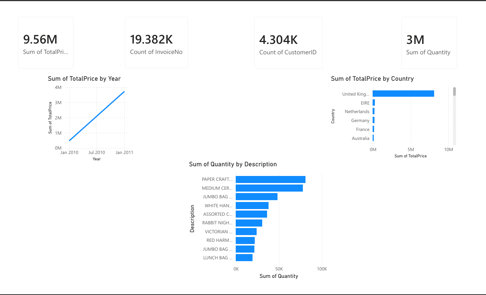

### 2. Sales Trend Analysis Dashboard
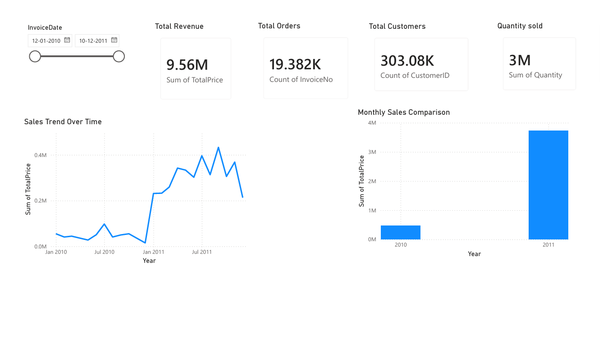

### 3. Product Performance Dashboard
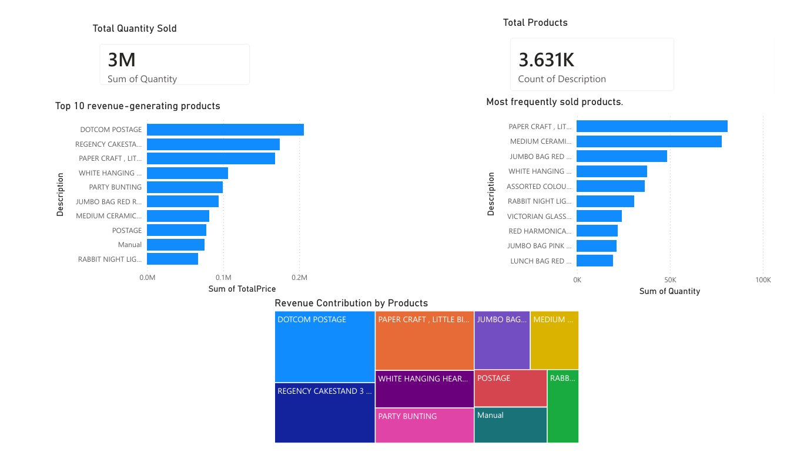

### 4. Customer Analytics & Segmentation
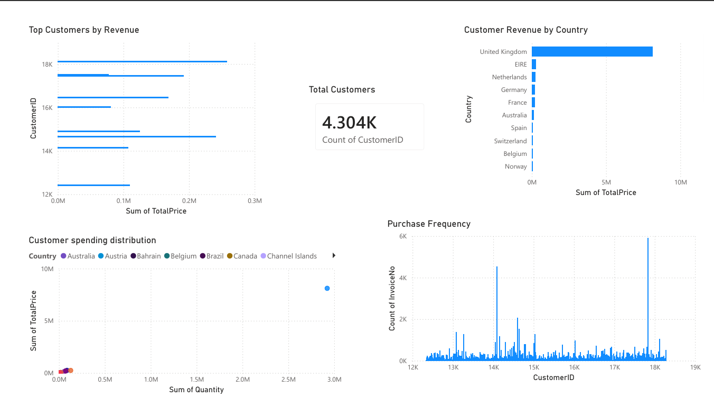

### 5. Region/Country Sales Dashboard
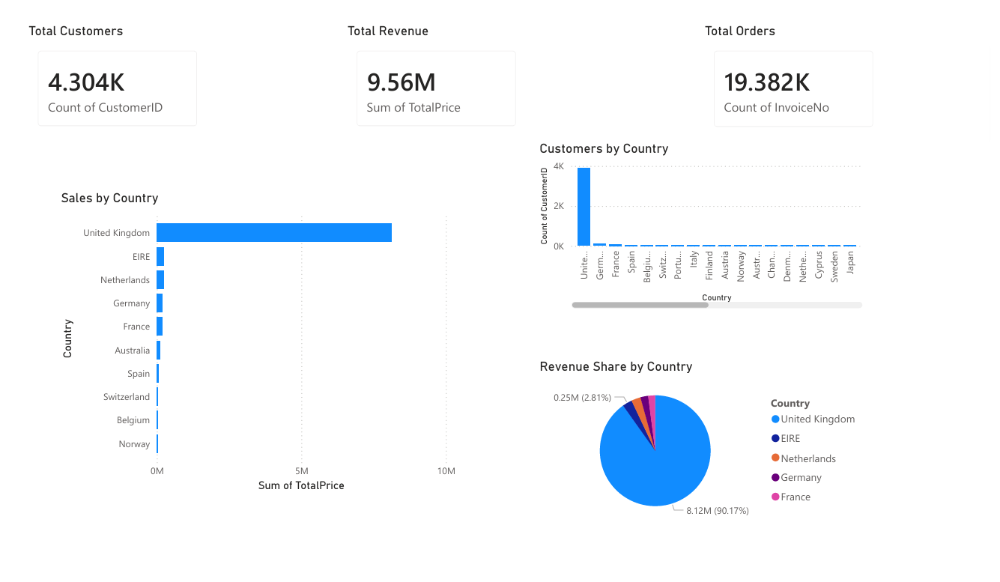

### 6. Monthly & Seasonal Sales Dashboard
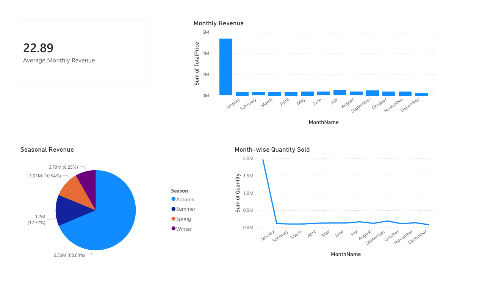

### 7. Customer Behaviour Dashboard
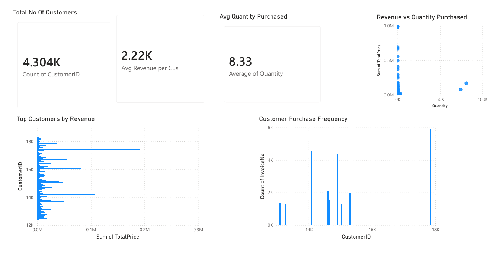

### 8. Profit & Revenue Analysis Dashboard
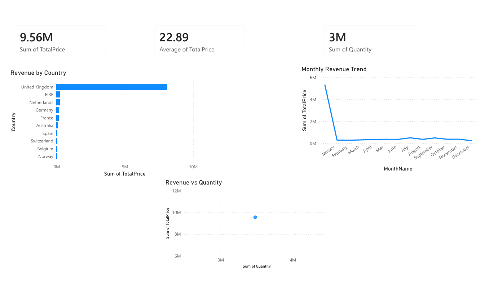

### 9. Inventory Risk Dashboard
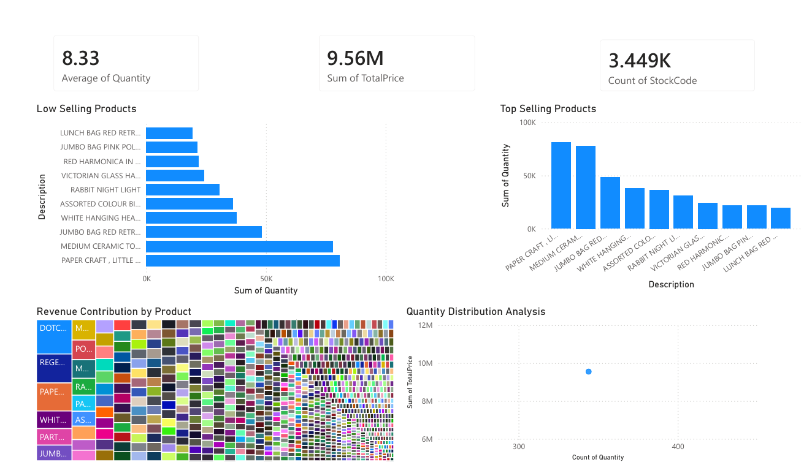

### 10. Order & Transaction Dashboard
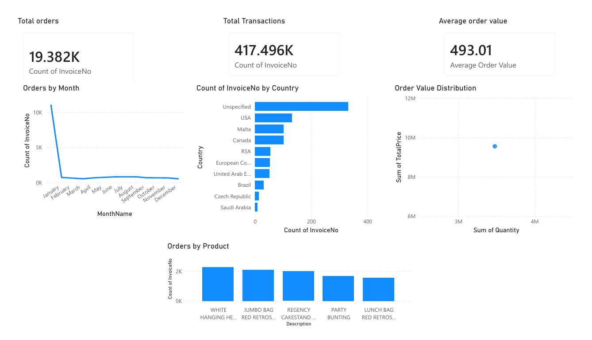

### 11. Advanced Analytics Dashboard
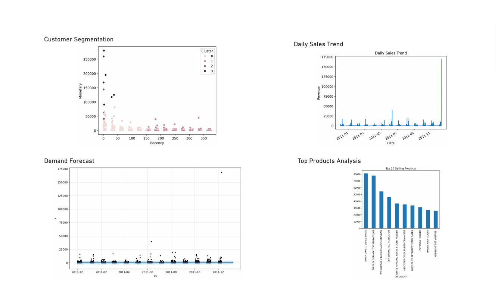

### 12. Interactive Filter Dashboard
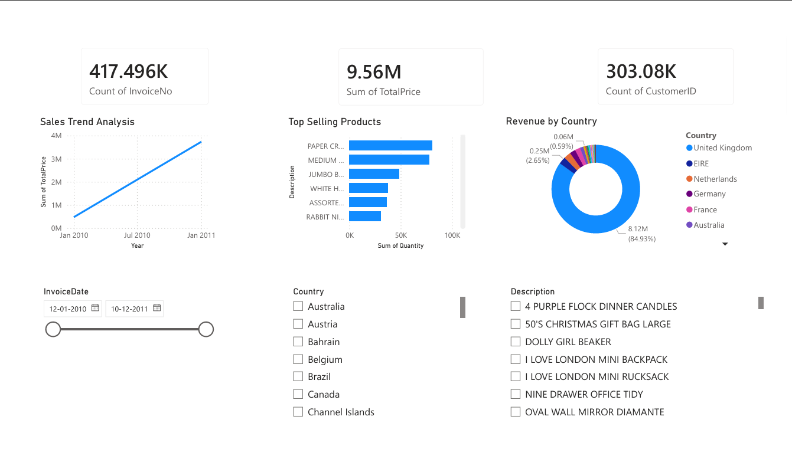


👩‍💻 Author


Pranavi Chelumala

\- 🎓 B.Tech Computer Science \& Data Science — CMR Institute of Technology, Hyderabad

\- 💼 Data Science \& Analytics — Industry Project

\- 🔗 \[LinkedIn](https://www.linkedin.com/in/pranavi-chelumala-4b45162a5/)

\- 📧 chelumalapranavi@gmail.com


\---


📄 License


This project is for educational and portfolio purposes.


\---


"In God we trust. Everyone else must bring data." — W. Edwards Deming\*


